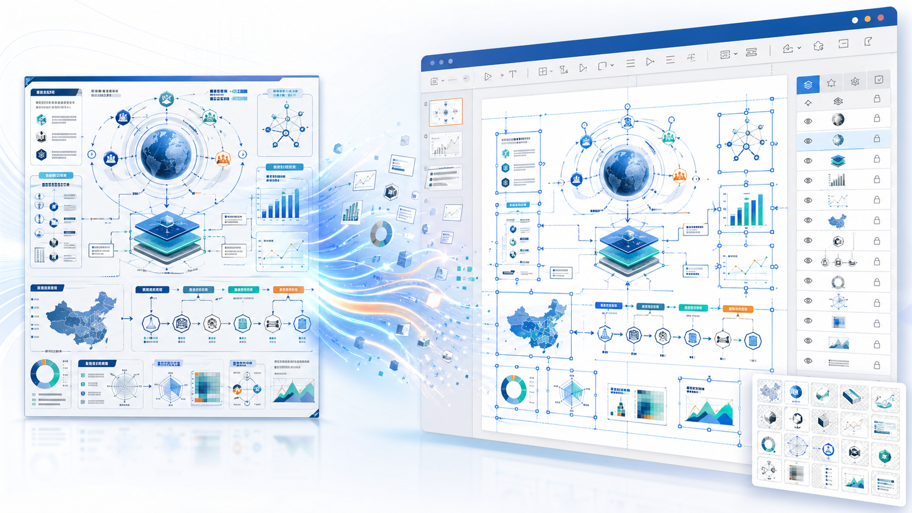
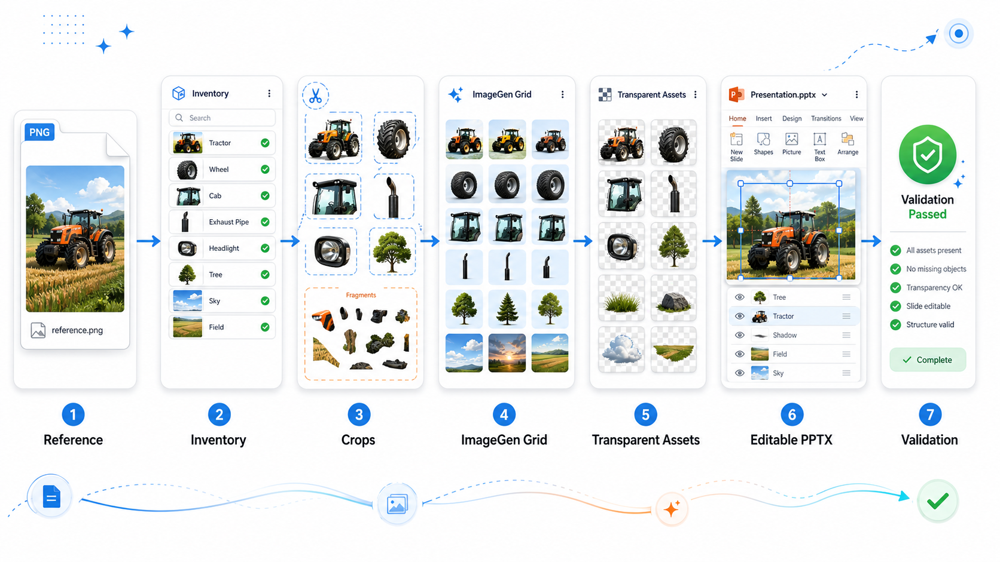
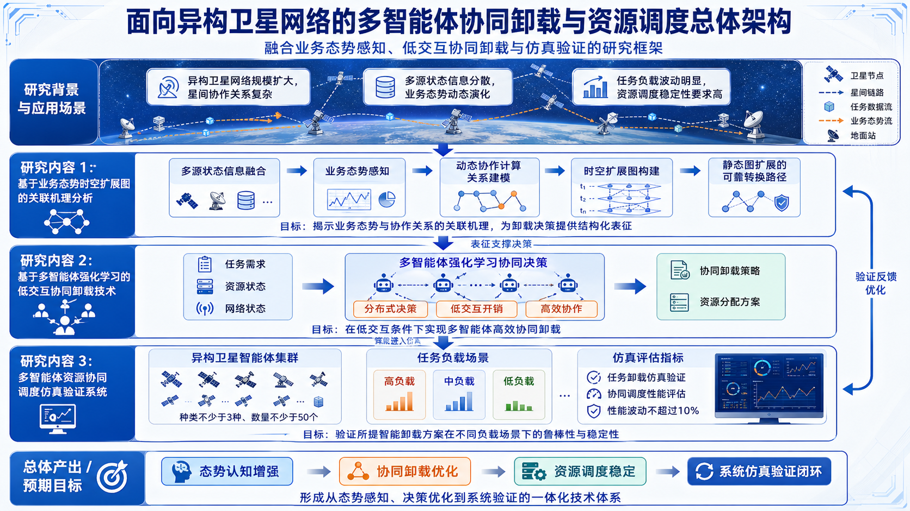
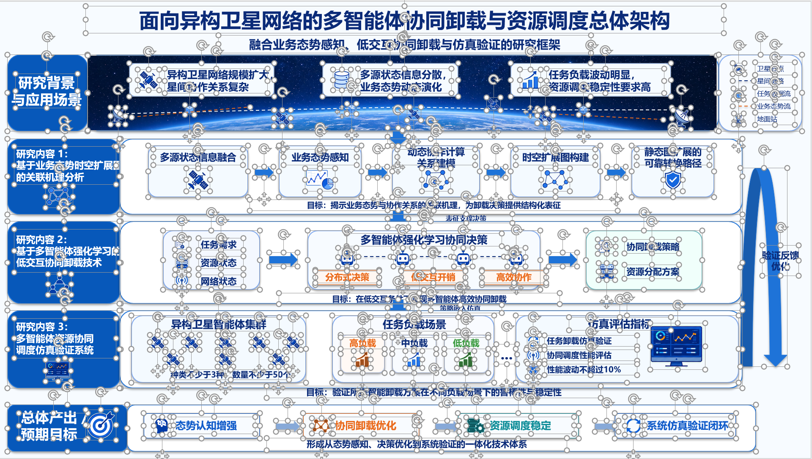

# PPT Visual Replica


[English README](README.en.md)

将扁平化信息图精准转化为可编辑的 PowerPoint 页面：文本和布局保持 PPT 原生可编辑特性；语义图标、设备、图表、屏幕等视觉元素拆分为独立的透明 PNG 素材，以最小语义单元处理。


## 推荐提示词

```text
使用 PPT REPLICA SKILL 重建本地图片，使用 IMAGE GEN 提取透明素材。避免手动绘制矢量图，确保以最小语义单元的粒度可编辑。
```

## Star History

<a href="https://www.star-history.com/?repos=ZhiweiWei-NAMI%2FPPT-Visual-Replica&type=date&legend=top-left">
 <picture>
   <source media="(prefers-color-scheme: dark)" srcset="https://api.star-history.com/chart?repos=ZhiweiWei-NAMI/PPT-Visual-Replica&type=date&theme=dark&legend=top-left" />
   <source media="(prefers-color-scheme: light)" srcset="https://api.star-history.com/chart?repos=ZhiweiWei-NAMI/PPT-Visual-Replica&type=date&legend=top-left" />
   
 </picture>
</a>

## 项目主视觉



## 快速上手

本项目核心是通过以下规则由 AI Agent 智能重构页面：

* **文本内容**：使用 PPT 原生文本框，便于用户后续编辑。
* **布局版式**：使用 PPT 原生元素（如面板、分隔线、箭头、连接线等）。
* **语义视觉元素**：通过 IMAGE GEN 或其他支持图片输入的 API，提取为透明 PNG 格式。
* **最小语义单元**：图标、屏幕、图表、设备等均对应独立可选的 PPT 对象。

## 工作流示意



## 示例展示：Satellite 网络图

以下为典型主示例展示，左图为原始参考图片，右图为 PPT 复刻版（已全选元素截图）。示例为首次生成（Pass@1）结果，整体结构准确，但局部图标、细节及文字排版可能需要额外微调。

| 原始参考图                                                                      | PPT中全选可编辑元素                                                                   |
| -------------------------------------------------------------------------- | ----------------------------------------------------------------------------- |
|  |  |

## 更多典型案例

| 示例                                                             | 描述                  |
| -------------------------------------------------------------- | ------------------- |
| [`satellite-network`](examples/satellite-network/)             | 异构卫星网络架构图，典型科研示例。   |
| [`medical-ai-pipeline`](examples/medical-ai-pipeline/)         | 多模态医学 AI 辅助诊断流程图示例。 |
| [`manufacturing-scheduler`](examples/manufacturing-scheduler/) | 智能制造多机器人协同调度方案示例。   |

## 已知问题与改进建议

* 若原图存在大量小图标，自动切割和去背景（Chroma-key）处理可能导致轻微边缘缺陷、裁切或语义匹配误差。建议预先使用[iconfont.cn](https://www.iconfont.cn/)等授权资源准备透明图标素材，再由 Agent 进行替换。
* 中文文字渲染偶尔会出现轻微对齐偏差，主要原因是字体、字号、行距与 PowerPoint 渲染机制差异所致。若追求高保真度，建议在 PPT 中手动微调，或明确字号和行距要求给 Agent 进一步优化。

可参考的替换提示词：

```text
我已将替换图标存放至 assets/user-icons/ 文件夹，请使用以下透明 PNG 替换对应语义单元：database_stack、server_rack、monitor_dashboard。确保保持原始边界框、尺寸和 PPT 中的最小语义可编辑粒度，并在 asset_manifest.json 中记录为 provided_asset。
```

## Skill 安装方法

推荐通过 Codex Skill Installer 从 GitHub 仓库路径安装：

```text
$skill-installer install https://github.com/ZhiweiWei-NAMI/PPT-Visual-Replica/tree/main/skill/ppt-visual-replica
```

也可以手动克隆仓库并复制 skill 目录：

**Windows:**

```powershell
git clone https://github.com/ZhiweiWei-NAMI/PPT-Visual-Replica.git
Copy-Item -Recurse .\PPT-Visual-Replica\skill\ppt-visual-replica "$env:USERPROFILE\.codex\skills\"
```

**macOS/Linux:**

```bash
git clone https://github.com/ZhiweiWei-NAMI/PPT-Visual-Replica.git
mkdir -p ~/.codex/skills
cp -R PPT-Visual-Replica/skill/ppt-visual-replica ~/.codex/skills/
```

安装完成后，重启 Codex 以加载新 skill。
