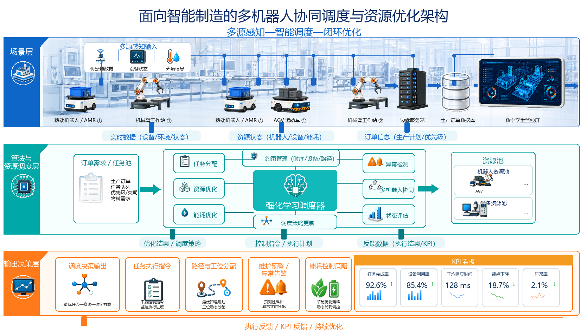
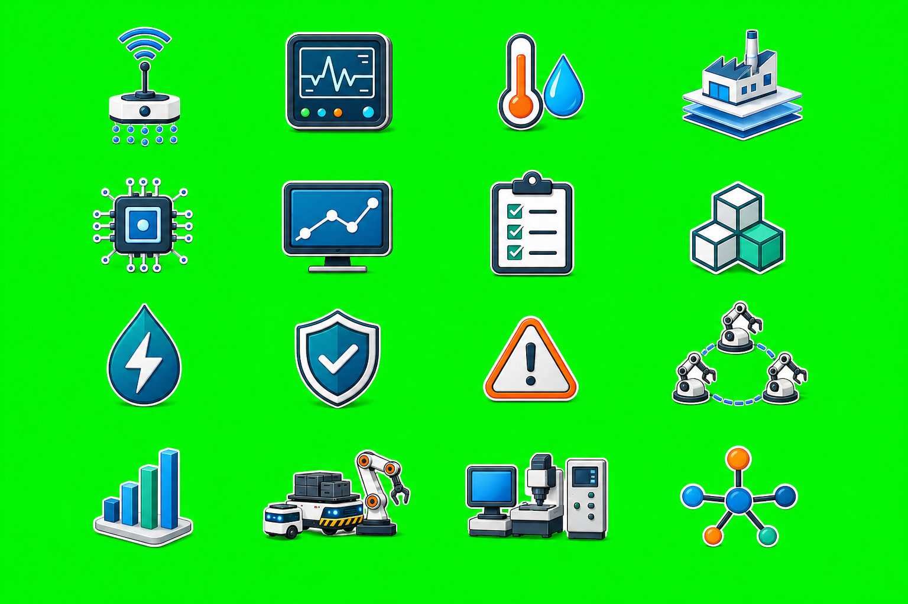
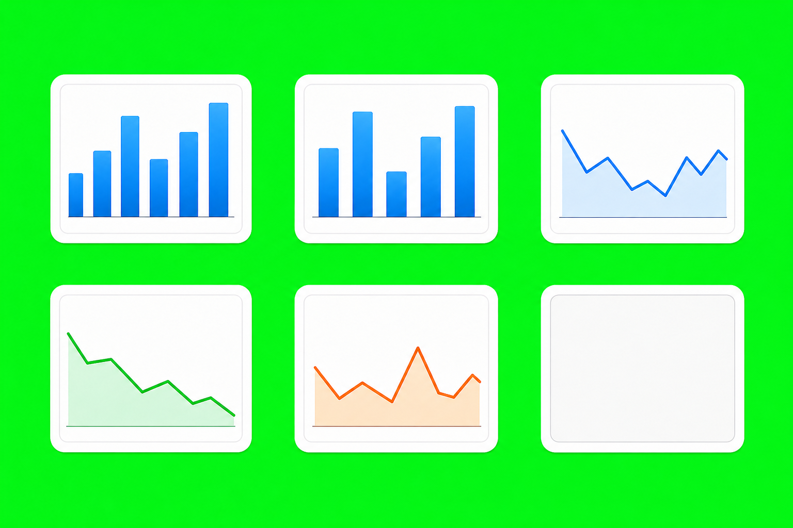
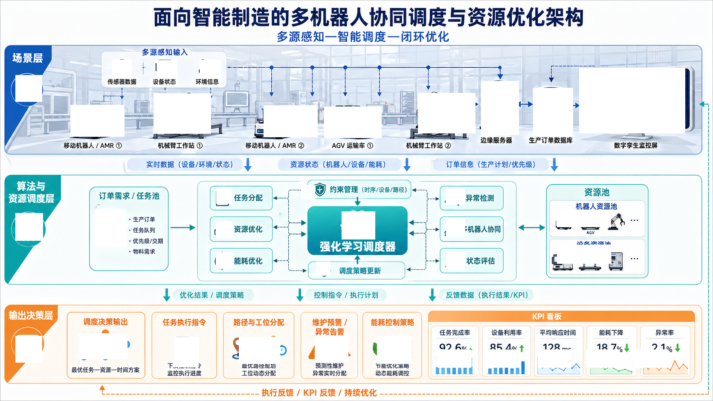

# Manufacturing Scheduler Golden Example

[中文说明](README.md)

This example archives a complete `ppt-visual-replica` run for a Chinese intelligent manufacturing multi-robot collaborative scheduling architecture infographic.

This is a Pass@1 result. The generated file paths were reorganized only to make the artifact bundle easier to understand and reuse.

## Invocation Prompt

```text
使用PPT REPLICA SKILL重新绘制本地图，使用IMAGE GEN提取透明素材，不要自己画矢量图，保持最小语义可编辑
```

## Archived Asset-Generation Prompt Records

The asset-generation prompt records are available in `imagegen/prompts/`.

| File | Prompt |
| --- | --- |
| `assets_cycle_1.jsonl` | `3x4 grid: AMR, robot arm, AGV, server, database, digital twin screen, clipboard, brain scheduler, alarm, energy leaves and battery, route pins, KPI dashboard; flat #00ff00 chroma-key; no text.` |
| `assets_cycle_2.jsonl` | `4x4 grid: sensing/status/environment/factory/chip/output/task/resource/energy/constraint/anomaly/collaboration/status/resource pool/device pool/dispatch icons; flat #00ff00 chroma-key; no text.` |
| `assets_cycle_3.jsonl` | `2x3 grid: KPI mini chart icons and blank KPI card; flat #00ff00 chroma-key; no text or numbers.` |
| `assets_cycle_4.jsonl` | `1x2 grid: green energy leaf battery and green energy-down KPI chart; flat #ff00ff chroma-key; no text or numbers.` |
| `scene_background.jsonl` | `Wide pale intelligent manufacturing workshop background, no foreground semantic objects, no text, suitable for overlay.` |

## Real Intermediate Artifacts

| Stage | File | Notes |
| --- | --- | --- |
| Reference | `reference/reference.png` | Flat source image, 1672x941 px. |
| Asset prompt records | `imagegen/prompts/` | Four asset-grid prompts and one background prompt. |
| Generated asset grids | `imagegen/generated/` | Four generated asset grids with cut manifests. |
| Transparent assets | `imagegen/transparent-assets/` | 36 transparent PNG semantic assets. |
| Reference crops | `audit/reference_crops/` | 36 reference crop files. |
| Residual after coverage | `audit/residual_cycle_1.png` | Residual image after matched semantic asset slots were covered. |
| Red-box locations | `audit/residual_cycle_1_redboxes.json` | JSON coordinates for semantic visual anchors. |
| Asset matching | `audit/asset_match_cycle_1.json` | Anchor-to-PNG assignment records. |
| Contact sheet | `audit/asset_contact_sheet.png` | Contact sheet for transparent assets. |
| Final PPTX | `output/replica.pptx` | Editable PowerPoint replica. |
| Preview | `output/preview.png` | Script-rendered preview image. |
| Validation | `output/validation_report.json` | Validation report and known limits. |

## Preview



## Generated Sources







## Residual Image



## Red-Box Locations

These coordinates are copied from `audit/residual_cycle_1_redboxes.json` in `[x, y, width, height]` format.

| # | semantic_unit_id | bbox |
| --- | --- | --- |
| 1 | `scene_layer_icon` | `[36, 176, 62, 62]` |
| 2 | `sensor_icon` | `[263, 140, 45, 42]` |
| 3 | `status_icon` | `[367, 141, 48, 42]` |
| 4 | `environment_icon` | `[468, 140, 50, 42]` |
| 5 | `amr_1` | `[165, 246, 126, 74]` |
| 6 | `robot_arm_1` | `[360, 219, 134, 94]` |
| 7 | `amr_2` | `[618, 247, 126, 74]` |
| 8 | `agv_1` | `[760, 250, 134, 73]` |
| 9 | `robot_arm_2` | `[980, 218, 134, 94]` |
| 10 | `server_1` | `[1128, 190, 88, 126]` |
| 11 | `database_1` | `[1250, 206, 93, 112]` |
| 12 | `twin_screen_1` | `[1358, 159, 248, 153]` |
| 13 | `algorithm_layer_icon` | `[36, 500, 64, 64]` |
| 14 | `order_clipboard` | `[223, 492, 72, 86]` |
| 15 | `task_assign_icon` | `[507, 441, 36, 36]` |
| 16 | `resource_icon` | `[506, 519, 38, 38]` |
| 17 | `energy_icon` | `[506, 592, 38, 38]` |
| 18 | `constraint_icon` | `[706, 434, 32, 32]` |
| 19 | `brain_scheduler_icon` | `[801, 496, 78, 65]` |
| 20 | `policy_update_icon` | `[742, 614, 32, 32]` |
| 21 | `anomaly_icon` | `[1045, 443, 44, 36]` |
| 22 | `collab_icon` | `[1046, 512, 44, 42]` |
| 23 | `status_eval_icon` | `[1046, 591, 44, 42]` |
| 24 | `resource_pool_group_icon` | `[1306, 492, 126, 40]` |
| 25 | `device_pool_group_icon` | `[1306, 574, 126, 44]` |
| 26 | `output_layer_icon` | `[36, 788, 62, 62]` |
| 27 | `decision_graph_icon` | `[184, 782, 114, 60]` |
| 28 | `execution_doc_icon` | `[407, 791, 58, 70]` |
| 29 | `route_icon` | `[560, 790, 96, 63]` |
| 30 | `alarm_output_icon` | `[738, 788, 78, 62]` |
| 31 | `energy_output_icon` | `[884, 788, 80, 65]` |
| 32 | `kpi_bar_completion` | `[1026, 820, 78, 42]` |
| 33 | `kpi_bar_utilization` | `[1140, 820, 78, 42]` |
| 34 | `kpi_line_response` | `[1261, 820, 78, 42]` |
| 35 | `kpi_line_energy` | `[1375, 820, 78, 42]` |
| 36 | `kpi_line_anomaly` | `[1489, 820, 78, 42]` |

## Known Limit

The validation report records a script-rendered preview for visual inspection. PowerPoint/LibreOffice render parity was not checked. Generated icons match semantic role and palette, not pixel-identical source glyphs.

