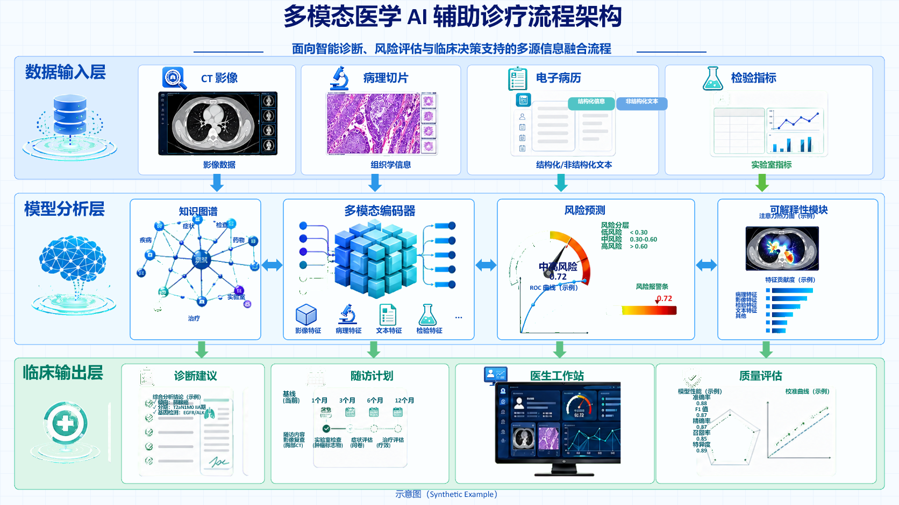
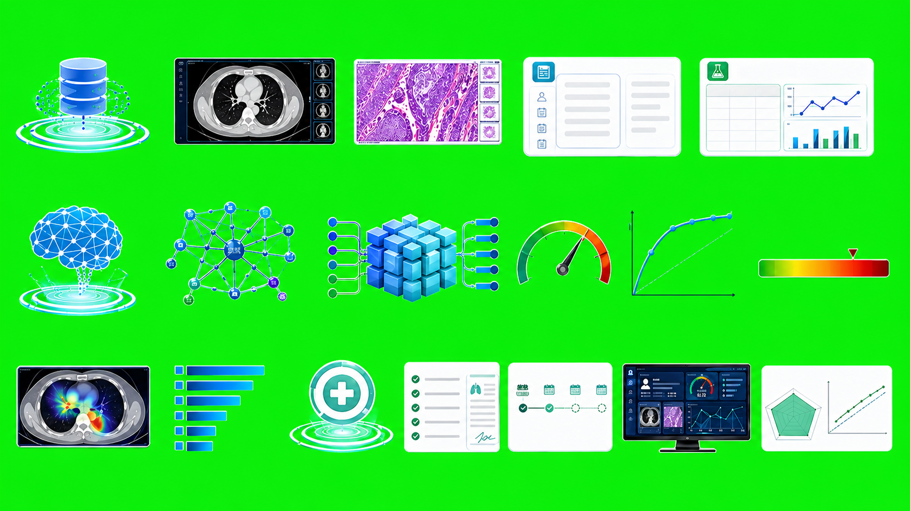
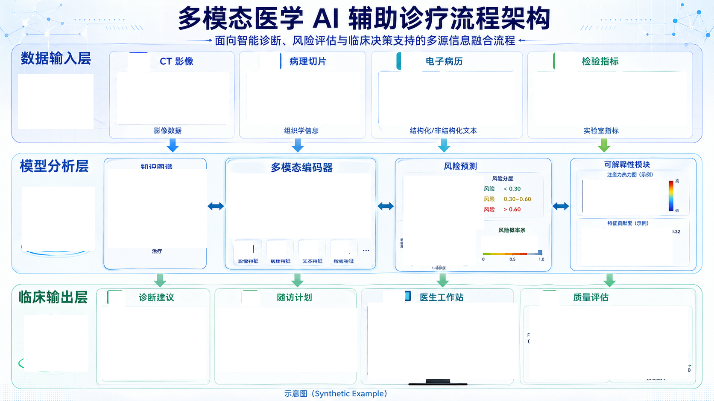

# Medical AI Pipeline Golden Example

[中文说明](README.md)

This example archives a complete `ppt-visual-replica` run for a Chinese multimodal medical AI assisted diagnosis workflow infographic.

This is a Pass@1 result. The generated file paths were reorganized only to make the artifact bundle easier to understand and reuse.

## Invocation Prompt

```text
使用PPT REPLICA SKILL重新绘制本地图，使用IMAGE GEN提取透明素材，不要自己画矢量图，保持最小语义可编辑
```

## Archived Asset-Generation Prompt Record

The asset-generation prompt record is available at `imagegen/prompts/assets_cycle_1.jsonl` and contains:

| Type | Prompt |
| --- | --- |
| `main_visual_grid` | `Create isolated chroma-key asset grid for database, CT, pathology, EMR, lab panel, brain, knowledge graph, encoder cube, risk gauge, ROC, risk scale, heatmap, feature bars, cross, diagnosis panel, follow-up panel, workstation, quality panel.` |
| `small_icon_grid` | `Create isolated chroma-key icon grid for CT, microscope, EMR, lab flask, feature cube, pathology, document, flask, diagnosis, calendar, workstation, quality shield icons.` |

## Real Intermediate Artifacts

| Stage | File | Notes |
| --- | --- | --- |
| Reference | `reference/reference.png` | Flat source image, 1672x941 px. |
| Asset prompt record | `imagegen/prompts/assets_cycle_1.jsonl` | Two preserved asset-generation prompt records. |
| Generated asset grid | `imagegen/generated/asset_grid_cycle_1.png` | Generated grid for larger semantic visual units. |
| Generated icon grid | `imagegen/generated/icon_grid_cycle_1.png` | Generated grid for small semantic icons. |
| Transparent assets | `imagegen/transparent-assets/` | 30 transparent PNG semantic assets. |
| Reference crops | `audit/reference_crops/` | 31 reference crop files and manifest. |
| Residual after coverage | `audit/residual_cycle_1.png` | Residual image after matched semantic asset slots were covered. |
| Red-box locations | `audit/residual_cycle_1_redboxes.json` | JSON coordinates for semantic visual anchors. |
| Asset matching | `audit/asset_match_cycle_1.json` | Anchor-to-PNG assignment records. |
| Contact sheet | `audit/asset_contact_sheet.png` | Contact sheet for transparent assets. |
| Final PPTX | `output/replica.pptx` | Editable PowerPoint replica. |
| Preview | `output/preview.png` | Script-rendered preview image. |
| Validation | `output/validation_report.json` | Validation report and known limits. |

## Preview



## Generated Sources




## Residual Image



## Red-Box Locations

These coordinates are copied from `audit/residual_cycle_1_redboxes.json` in `[x, y, width, height]` format.

| # | semantic_unit_id | bbox |
| --- | --- | --- |
| 1 | `database_orbit` | `[42, 174, 176, 128]` |
| 2 | `icon_ct_magnifier` | `[300, 124, 50, 44]` |
| 3 | `ct_scan_screen` | `[275, 170, 260, 120]` |
| 4 | `icon_microscope_header` | `[608, 122, 46, 48]` |
| 5 | `pathology_slide` | `[579, 169, 262, 122]` |
| 6 | `icon_emr_clipboard` | `[939, 122, 48, 48]` |
| 7 | `emr_panel` | `[888, 168, 318, 124]` |
| 8 | `icon_lab_flask_green` | `[1300, 122, 52, 48]` |
| 9 | `lab_panel` | `[1252, 168, 356, 125]` |
| 10 | `brain_network` | `[52, 438, 170, 150]` |
| 11 | `knowledge_graph` | `[252, 397, 232, 184]` |
| 12 | `encoder_cube` | `[536, 407, 332, 150]` |
| 13 | `icon_cube_feature` | `[548, 565, 43, 43]` |
| 14 | `icon_microscope_feature` | `[625, 565, 43, 43]` |
| 15 | `icon_document_feature` | `[700, 565, 43, 43]` |
| 16 | `icon_flask_feature` | `[774, 565, 43, 43]` |
| 17 | `risk_gauge` | `[946, 412, 186, 125]` |
| 18 | `roc_curve` | `[944, 516, 170, 106]` |
| 19 | `risk_scale` | `[1127, 554, 132, 38]` |
| 20 | `explainability_heatmap` | `[1365, 421, 180, 84]` |
| 21 | `feature_bars` | `[1362, 536, 212, 85]` |
| 22 | `medical_cross` | `[56, 739, 150, 132]` |
| 23 | `icon_diagnosis_clipboard` | `[254, 682, 38, 38]` |
| 24 | `diagnosis_panel` | `[237, 720, 244, 168]` |
| 25 | `icon_calendar` | `[566, 682, 42, 38]` |
| 26 | `followup_panel` | `[504, 722, 332, 150]` |
| 27 | `icon_workstation_monitor` | `[897, 682, 50, 38]` |
| 28 | `doctor_workstation` | `[862, 710, 350, 178]` |
| 29 | `icon_quality_shield` | `[1265, 682, 44, 42]` |
| 30 | `quality_panel` | `[1240, 718, 370, 170]` |

## Known Limit

The validation report records package-level OpenXML/media inspection and script-rendered visual inspection. Desktop PowerPoint rendering was not launched. Generated icons match semantic role and palette, not pixel-identical source glyphs.

