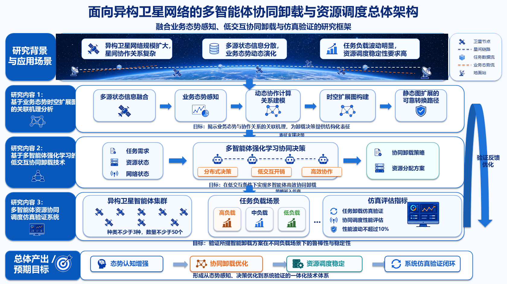
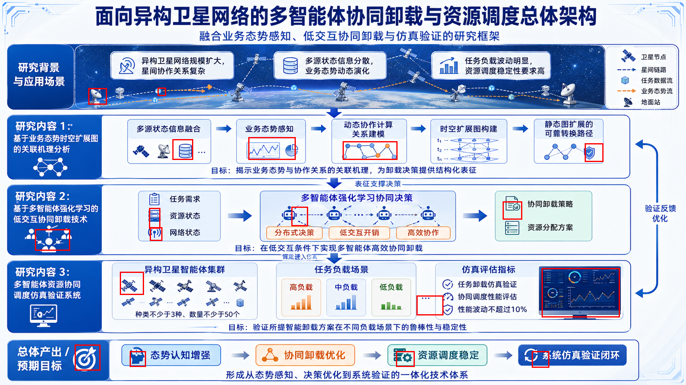

# 卫星网络黄金示例

[English README](README.en.md)

本示例归档了一次完整的 `ppt-visual-replica` 运行，用于将一张中文科研架构信息图重绘为可编辑 PowerPoint。

这是一次 Pass@1 的结果；为便于理解和复用，只对生成文件的路径做了归档重整。

## 调用提示词

```text
使用PPT REPLICA SKILL重新绘制本地图，使用IMAGE GEN提取透明素材，不要自己画矢量图，保持最小语义可编辑
```

## 已归档的生成素材提示词记录

生成素材提示词记录见 `imagegen/prompts/assets_cycle_1.jsonl`，内容如下：

| 字段 | 归档值 |
| --- | --- |
| cycle | `1` |
| prompt_summary | `Generated 18 isolated infographic icons on #00ff00 chroma-key background using the reference slide for style and identity.` |
| grid | `3x6, margin 80 px, gap 48 px, no text` |
| objects_in_order | `satellite_node`, `ground_station`, `database_stack`, `bar_chart`, `line_pie_chart`, `network_graph`, `shield_check`, `robot_agent`, `server_rack`, `document_check`, `monitor_dashboard`, `target`, `circular_arrows`, `wireless_status`, `collaboration_group`, `brain_head`, `server_gear`, `task_cube` |

## 真实中间结果

| 阶段 | 文件 | 说明 |
| --- | --- | --- |
| 参考图 | `reference/reference.png` | 原始扁平参考图。 |
| 素材提示词记录 | `imagegen/prompts/assets_cycle_1.jsonl` | 保存了提示词摘要、网格规则和对象顺序。 |
| 生成图标网格 | `imagegen/generated/imagegen_asset_grid_cycle_1.png` | 18 个语义图标素材的生成网格。 |
| 生成背景图 | `imagegen/generated/imagegen_space_background.png` | 顶部太空/地球背景的生成来源。 |
| 透明素材 | `imagegen/transparent-assets/` | 23 个 PNG，包括切出的透明图标、颜色变体和背景裁切。 |
| 初始残差图 | `audit/residual_cycle_0.png` | 初始 residual 图。 |
| 覆盖后的残差/丢失图 | `audit/residual_cycle_1.png` | 覆盖已匹配语义素材锚点后的 residual 图。 |
| 红框定位 | `audit/residual_cycle_1_redboxes.json` | 语义素材锚点的 JSON 坐标记录。 |
| 素材匹配 | `audit/asset_match_cycle_1.json` | 生成网格来源、切图规则和已匹配素材 ID。 |
| 最终 PPT | `output/replica.pptx` | 可编辑 PowerPoint 复刻结果。 |
| PowerPoint 预览 | `output/preview.png` | 由 PowerPoint 导出的预览图。 |
| 验证报告 | `output/validation_report.json` | 验证项和已知限制。 |

## 结果预览



## 生成来源图


## 残差/丢失图

初始残差图：


覆盖后的残差/丢失图：



## 红框定位

以下坐标直接来自 `audit/residual_cycle_1_redboxes.json`。

| # | semantic_unit_id | bbox_px |
| --- | --- | --- |
| 1 | `satellite_node` | `[292, 664, 350, 720]` |
| 2 | `ground_station` | `[215, 215, 260, 255]` |
| 3 | `database_stack` | `[420, 340, 470, 390]` |
| 4 | `bar_chart` | `[1015, 722, 1080, 770]` |
| 5 | `line_pie_chart` | `[605, 335, 720, 390]` |
| 6 | `network_graph` | `[835, 345, 968, 390]` |
| 7 | `shield_check` | `[1425, 350, 1470, 395]` |
| 8 | `robot_agent` | `[710, 505, 750, 552]` |
| 9 | `server_rack` | `[363, 508, 390, 558]` |
| 10 | `document_check` | `[1225, 492, 1272, 536]` |
| 11 | `monitor_dashboard` | `[1320, 655, 1510, 775]` |
| 12 | `target` | `[182, 842, 244, 905]` |
| 13 | `circular_arrows` | `[1296, 858, 1338, 898]` |
| 14 | `wireless_status` | `[365, 555, 395, 588]` |
| 15 | `collaboration_group` | `[85, 560, 170, 612]` |
| 16 | `brain_head` | `[316, 858, 355, 896]` |
| 17 | `server_gear` | `[965, 858, 1010, 896]` |
| 18 | `task_cube` | `[384, 214, 404, 234]` |

## 已知限制

生成图标匹配的是语义角色和整体配色，不追求与参考图中的原始小图标像素级一致。最终 PPT 保留文本、布局结构和语义素材的最小可编辑粒度。
